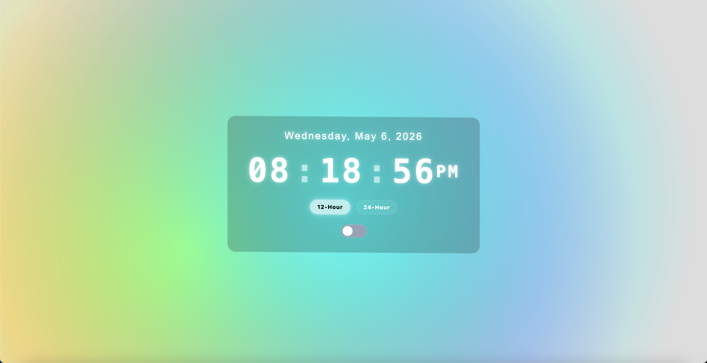
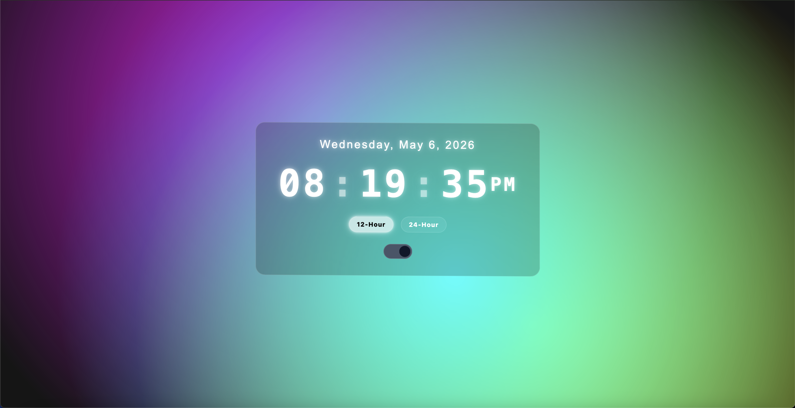

# macOS-Inspired Digital Clock

## Overview

This project is a lightweight digital clock built using vanilla Javascript, HTML, and CSS. This application is designed specifically to resemble the minimial and glassy aesthetic of macOS.

The purpose of this project is to demonstrate fundamental front-end development skills, which includes DOM manipulation, time-based updates, and UI styling inspired by a real-world interface.

The following screenshots are some of the inspirations for the design of this project:

1. Light Stream Green Wallpaper


3. Flurry Screen Saver


---

## Demo

### Preview

Light Mode:


Dark Mode:


### Live demo

[Click here!](https://braeden-rodgers.github.io/js-digital-clock/)

## Features

* Real-time clock that updates every second
* Supports 12-hour and 24-hour time formats
* macOS-inspired design and animation
* Light/dark mode toggle
* Animations and transitions for a smooth, tranquil experience
* Synchronization between the OS theme and program theme

## Project Structure

```
js-digital-clock/
│── index.html      # Main HTML structure and SVG animation implementation
│── style.css       # macOS-inspired styling
│── main.js         # Clock logic and time updates
└── assets/         # Additional files (e.g., images)
```

---

## How It Works

The JavaScript file uses the JavaScript's built-in Date object to retrieve the current system time.

* Rotating gradients are handled in HTML
* Function `updateTime` extracts the date, hours, minutes, and seconds from the `Date` object
* Function `updateTime` also formats the time based on the user's selected format
* Method `setInterval` is used on `updateTime` to update the time every second (`1000ms`)
* Visuals and layout are handled in CSS along with the dark mode toggle

---

## Installation & Usage

### Run Locally

1. Clone this repository:

   ```
   git clone https://github.com/braeden-rodgers/js-digital-clock.git
   ```
2. Navigate to the project directory
3. Open the HTML file `index.html` in your browser

### Live Version

If you would like to see the live version of the project, visit:

```
https://braeden-rodgers.github.io/js-digital-clock/
```

---

## Improvements

* Add timezone selection support
* Implement alarm and notification features
* Enhance the design
* Include an icon

---

## Learning Outcomes

* DOM manipulation
* Date and time formatting
* JavaScript's built-in timing methods
* CSS layout and UI design

---

## Attribution

This project uses a background animation to achieve the macOS aesthetics featuring sophisticated gradients based on:

["SVG Animation Background" by Álvaro (@alvarotrigo)](https://codepen.io/alvarotrigo/pen/qBMMyxz)

Modifications: Simplified SVG paths and adjusted animation speed

License: MIT

---

## Acknowledgments

* Inspired by the macOS visual design
* Built as a practice project for front-end fundamentals

---
