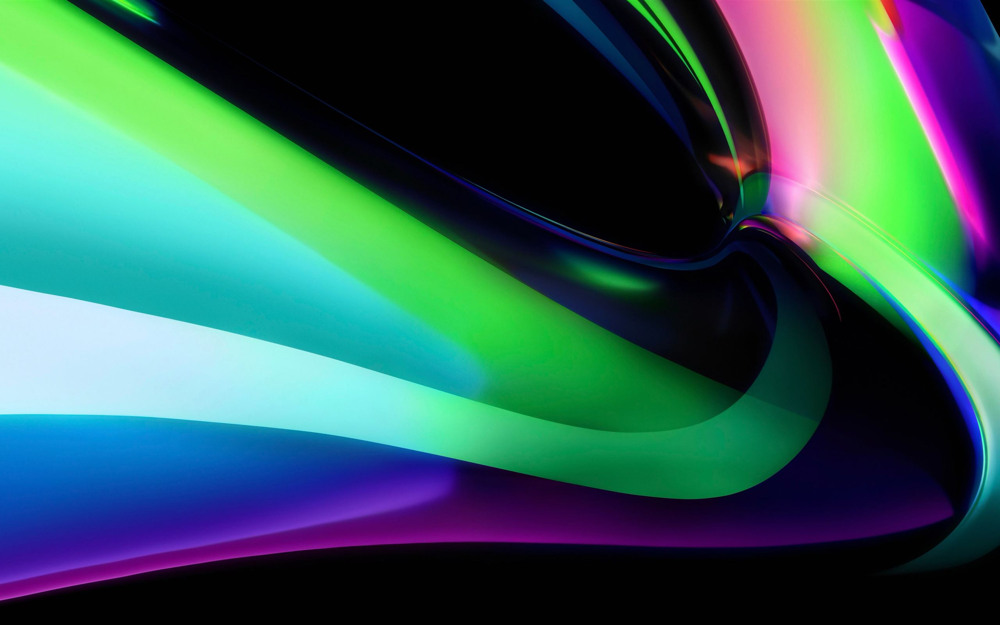
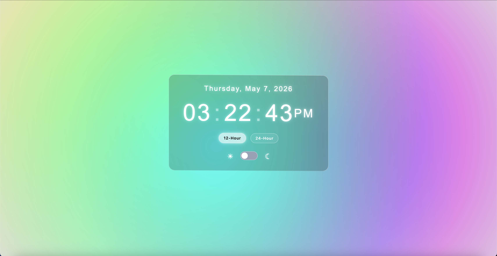
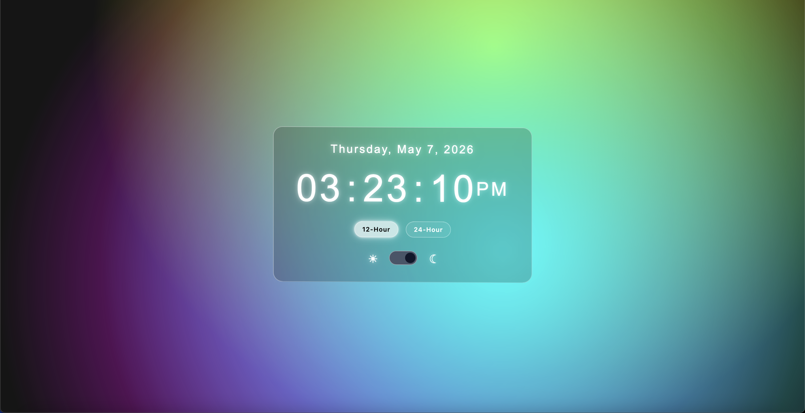

# macOS-Inspired Digital Clock

## Overview

This project is a lightweight digital clock built using vanilla Javascript, HTML, and CSS. This application is designed to resemble the minimial and glassy aesthetic of macOS Tahoe 26.

The purpose of this project is to demonstrate fundamental front-end development skills, which includes DOM manipulation, time-based updates, and UI styling inspired by a real-world interface.

The following screenshots are some of the inspirations for the design of this project:

1. Light Stream Green Wallpaper



2. Flurry Screen Saver


---

## Demo

### Preview

Light Mode:


Dark Mode:


Reduce Motion Disabled:


Reduce Motion Enabled:


### Live Demo

[Click here!](https://braeden-rodgers.github.io/js-digital-clock/)

## Features

* Real-time clock that updates every second
* Supports 12-hour and 24-hour time formats
* macOS-inspired design and animations
* Light/dark mode toggle
* Animations and transitions developed for a smooth, tranquil experience
* Reduce motion support for accessbility

## Project Structure

```
js-digital-clock/
│── index.html      # Main HTML structure and SVG animation implementation
│── style.css       # macOS-inspired styling
│── script.js       # Clock and date logic, time updates, theme toggle, and caching preferences
└── assets/         # Additional files (e.g., images)
```

---

## How It Works

The JavaScript file uses the JavaScript's built-in Date object to retrieve the current system time.

* Rotating gradients are handled in HTML
* JSS handles the date, time, and theme components separately
* Function `updateDate` extracts the date from the Date object and creates a formatted string
* Function `updateTime` extracts the hours, minutes, and seconds from the `Date` object and determines the meridiem if the 12-hour format is used
* Function `updateTime` also formats the time based on the user's selected format
* Function `setTimeFormat` handles the time format toggle and caches the user's preference to the local storage
* Event listeners are implemented for the hour format buttons to update the styling within the buttons 
* Function `startClock` initiates the clock and syncs with real seconds
* Method `setInterval` is used on `updateDate` to update the date every day
* Method `setTimeout` is used on `updateTime` to update the time every second
* Function `setTheme` is used to handle light/dark mode toggle and stores the user's theme preference to local storage
* Visuals and layout are handled in CSS

---

## Installation & Usage

### Run Locally

1. Clone this repository:

   ```
   git clone https://github.com/braeden-rodgers/js-digital-clock.git
   ```
2. Navigate to the project directory
3. Open the HTML file `index.html` in your preferred browser (e.g, FireFox, Google Chrome, etc.)

### Live Demo

As mentioned before, if you would like to see the live version of the project, visit the following link:

```
https://braeden-rodgers.github.io/js-digital-clock/
```

---

## Possible Improvements

* Add timezone selection support
* Implement alarm and notification features
* Implement weather API

---

## Learning Outcomes

* DOM manipulation
* Date and time formatting
* JavaScript's built-in timing methods
* CSS layout and UI design
* Dynamic state handling
* Cache data in the browser via `localStorage`

---

## Attribution

This project uses a background animation to achieve the macOS-like aesthetic featuring sophisticated gradients based on:

["SVG Animation Background" by Álvaro (@alvarotrigo)](https://codepen.io/alvarotrigo/pen/qBMMyxz)

Modifications: Simplified SVG paths and adjusted animation speed

License: MIT

---

## Acknowledgments

* Inspired by the macOS Tahoe 26 visual design
* Built as a practice project for front-end fundamentals
